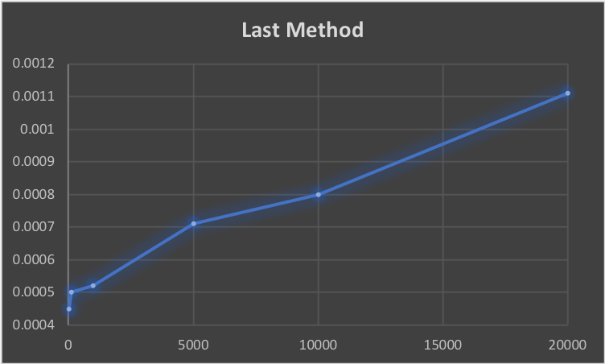
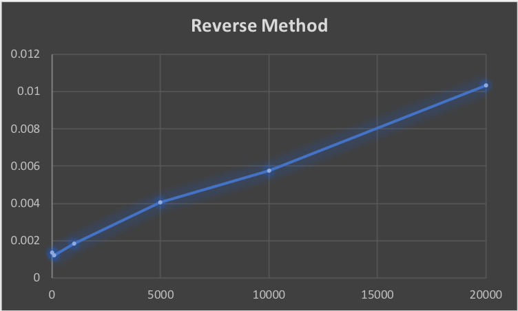
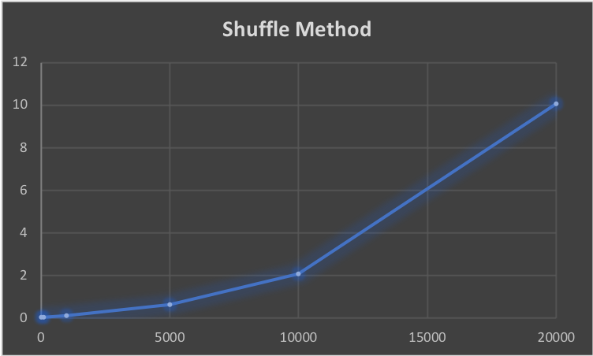
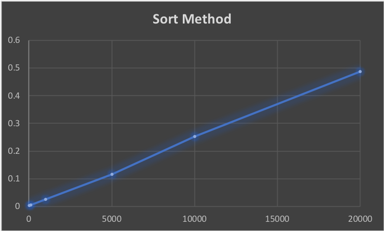
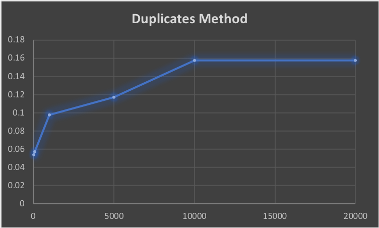
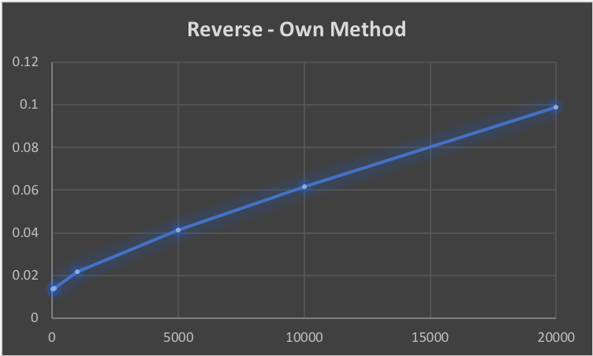
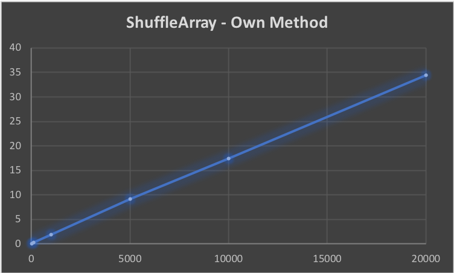
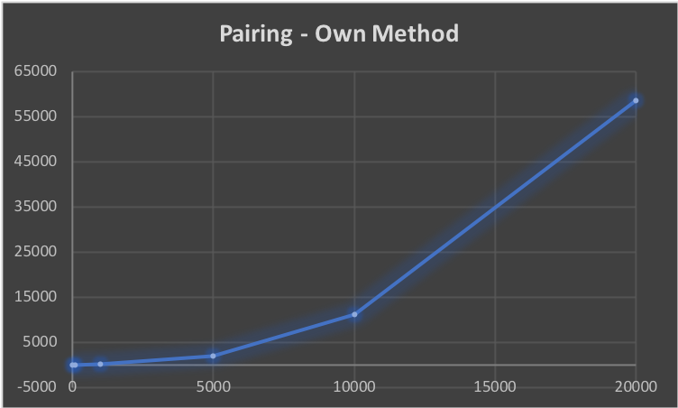
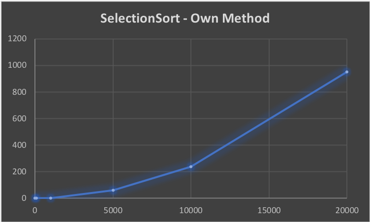

# Algorithmic Complexity

This is a project designed to reach the objectives:
* Can you mention efficiency as one of the dimensions of a good piece of code?
* Can you join a conversation about algorithms and their complexity?

## Timing Code

Within the `timings` sub-folder, there is an application that measures the length of time it takes to run an algorithm. It runs the algorithm 10 times and outputs the time taken for each.

### To Use the Timing Method
1. Clone this repository
```
git clone https://github.com/melissasedgwick/algorithmic-complexity.git
```
2. Navigate into the repository
```
cd algorithmic-complexity
```
3. Open the Program.cs file
```
open timings/timings/Program.cs
```
4. Add your method where it states:
```
  //METHOD TO TIME HERE
```
5. Run the program (from Command Line):
```
mono Program.exe
```
Or from Visual Studio by clicking the Play button.

6. The result will be output into a window.

### Results

Here are the result for testing different methods on lists of lengths 10, 100, 1000, 5000, 10000 and 20000 in C#:

Testing the Last method:


Testing the Reverse method:


Testing the Shuffle method:


Testing the Sort method:


## Alrogithms

The `algorithms` sub-folder contains algorithms I've written. Below are the results for the timing tests of these.

### Duplicates



The timings are quite varied, however, as the execution time for the algorithm depends on if (and how soon) a duplicate value appears.

### Reverse



The timings for this method are very similar to C#'s built in Reverse method.

### ShuffleArray



I managed to make this a linear method compared with the quadratic Shuffle method above.

### Pairing



This is the most time-consuming method so far, as it requires nested loops.

### SelectionSort


